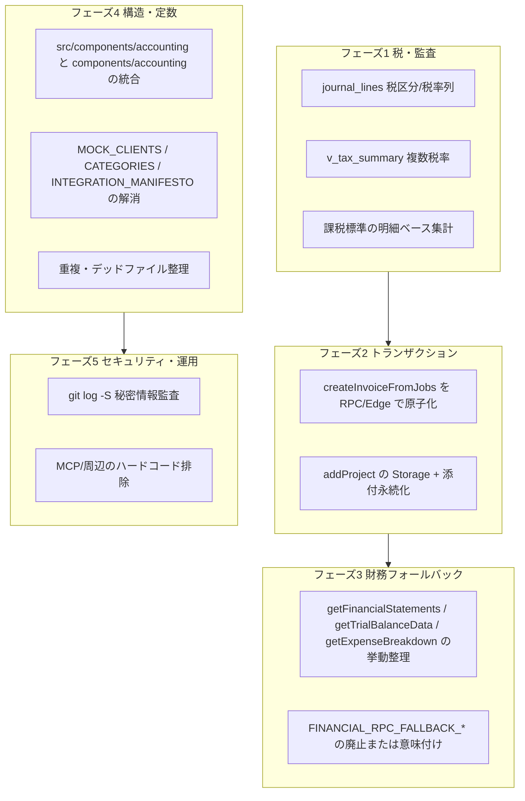

# 次期 AI エージェント向け・実行用ハンドオフ（完璧版）

**目的**: 前会話のエージェントは「方針・一覧」の提示に留まった。**あなたは実装・マイグレーション・検証まで完了させる。** 本書は推測を減らすため、**ファイルパス・概算行番号・検索キーワード**を載せている。行番号は改変でズレるため、`grep` / 全文検索で再アンカーすること。

---

## 1. 正典（読まずに着手しない）

| 優先 | ファイル | 役割 |
|------|----------|------|
| 必須 | リポジトリ直下 `AGENTS.md` | 画面とデータ源、VIEW 名、会計の原則、**完了の定義（DoD）** |
| 必須 | `docs/TECH_DEBT_BURNDOWN.md` | フェーズ別の意図された残作業（本書と重複するが**意図の説明**として読む） |
| 必須 | `.cursor/rules/project-context.mdc` | ハブ画面・VIEW 名の短縮メモ |

**会計の非交渉原則**（逸脱するならコードとドキュメントの両方に「意図的例外」を書く）:

1. 集計は DB（VIEW / RPC）寄せ。UI は原則読み取り。
2. データなしを 0 埋めでごまかさない（空・未集計を明示）。
3. 参照専用。誤解を招く編集 UI は置かない。

---

## 2. スコープ外・注意（時間を溶かさない）

| 対象 | 扱い |
|------|------|
| `PG/` | 過去・実験。`AGENTS.md` も「ルートアプリを正」と明記。**本タスクの完了条件に含めない。** |
| `ccpm/` 配下に見える **ネストした `.git`** | メイン製品のワークツリーと混同しない。誤ってサブモジュール扱いしないよう注意。 |
| `types_old.ts` | レガシー参照に注意。新規は `types.ts`。 |

---

## 3. 「前エージェントがやっていないこと」= あなたの仕事（全体マップ）

以下は **未完了か、コード上に明示的な TODO / 警告が残っている** 領域。ここを潰すとプロジェクトは「会計・請求・データ整合・構造負債」の面で一段完成に近づく。



---

## 4. バックログ（優先度つき・実行順の推奨）

**推奨順**: T1→T2→T3 → T4→T5 → T6→T7 → T8→T9→T10 → T11→T12。

各項目に **証拠**（どこを見るか）を付ける。

### T1–T3 — 税モデルと `v_tax_summary` の本番耐性

| ID | 作業 | 証拠・起点 | 受け入れ基準 |
|----|------|------------|--------------|
| T1 | `accounting.journal_lines` に税率・税区分（または税用補助テーブル）を追加 | `public.journal_lines` は `accounting.journal_lines` の VIEW（例: `supabase/migrations/20260303000000_fix_all_accounting_views.sql`）。実体 ALTER は **accounting スキーマ側** | マイグレーションで列または正規化テーブルが存在し、既存 VIEW が壊れない |
| T2 | `v_tax_summary` を複数税率・軽減に対応 | `supabase/migrations/20260321130000_v_tax_summary_aggregate.sql` 先頭コメントに「複数税率は journal_lines に税区分が載ったら差し替え」の記載あり | テスト用データまたは SQL コメントで、税率混在時の期待結果が説明できる |
| T3 | 売上・仕入の課税標準を「税額逆算」に依存しない | `TECH_DEBT_BURNDOWN.md` フェーズ1 | 集計定義がマイグレーションコメントで監査可能 |

### T4–T5 — 請求・案件の原子性と添付

| ID | 作業 | 証拠・起点 | 受け入れ基準 |
|----|------|------------|--------------|
| T4 | `createInvoiceFromJobs` を RPC または Edge Function でトランザクション化。採番を DB 側へ | `services/dataService.ts` 内 `createInvoiceFromJobs`（約 L4383 付近）。コメント: `// トランザクション・採番は RPC 化予定`。現状 `invoice_no` は `INV-${Date.now()}`。呼び出し: `components/accounting/BillingManagement.tsx` | 失敗時にヘッダのみ・明細のみが残らない。`dataService` のプレースホルダコメント削除 |
| T5 | AI 案件のファイルを Storage に保存し DB と紐付け | `components/sales/ProjectCreationPage.tsx` が `addProject(projectData, filesToUpload)` を呼ぶ。`services/dataService.ts` `addProject`（約 L3603 付近）で `_files` があると **`console.warn` で未実装明示** | 警告ログではなく実装。再ログイン後もファイル参照可能（RLS 含め設計） |

### T6–T7 — 財務 RPC と「広すぎる期間」問題

| ID | 作業 | 証拠・起点 | 受け入れ基準 |
|----|------|------------|--------------|
| T6 | `getFinancialStatements` / `getTrialBalanceData` の RPC 失敗時フォールバックの意味を仕様化 | `services/dataService.ts` 約 L5102–L5132（試算表・BS/PL）。RPC `get_financial_statements` 失敗時 `v_trial_balance` フォールバック | 「同一の数字を返すのか／返さないのか」をドキュメント化し、UI が誤解しない |
| T7 | `FINANCIAL_RPC_FALLBACK_*` の扱い | `services/accountingConstants.ts`（`FINANCIAL_RPC_FALLBACK_START_DATE` / `END_DATE`）。`getExpenseBreakdown`（約 L5154 付近）が **日付未指定時に 2000–2099 を RPC に渡す**。利用画面: `components/accounting/ManufacturingCostManagement.tsx` | 全期間ワンショットをやめるか、明示的な会計年度 UI とセットにする。**`docs/TECH_DEBT_BURNDOWN.md` の `getTopExpensesForStatement` はリポ内に存在しない** — 実体は `getExpenseBreakdown` + 上記定数とみなして直す |

### T8–T10 — UI 二重配置・定数・デッドコード

| ID | 作業 | 証拠・起点 | 受け入れ基準 |
|----|------|------------|--------------|
| T8 | `src/components/accounting/*` と `components/accounting/*` を単一ツリーへ | `App.tsx` 約 L178–L187: `AccountingDashboard` / `ApprovedApplications` / `UnhandledItemsPage` は **`./src/components/accounting/`**。他は多くが `./components/accounting/` | `App.tsx` の import が一本化。`vitest` の `tests/accountingApplicationFilter.test.ts` が `../src/components/accounting/accountingApplicationFilter` を参照 — **パス更新を忘れない** |
| T9 | `constants.ts` の `MOCK_CLIENTS` / `CATEGORIES` / `INTEGRATION_MANIFESTO` | `constants.ts` 約 L68–L112 に「開発引き継ぎ」コメント。利用例: `services/geminiService.ts`、`components/estimate/PrintEstimateApp.tsx` | 本番は Supabase マスタ取得、または機能フラグでデモ専用に閉じる — **どちらかをコードで完結** |
| T10 | 重複・旧ファイル | `components/accounting/JournalReviewPage_OLD.tsx`（現行は `JournalReviewPage.tsx`）。`components/accounting/accountingApplicationFilter.ts` と `src/components/accounting/accountingApplicationFilter.ts` の **二重** | 未使用なら削除。使用中なら単一ソースに統合後、片方削除 |

### T11–T12 — セキュリティ・周辺

| ID | 作業 | 受け入れ基準 |
|----|------|--------------|
| T11 | リポジトリ履歴に秘密情報が無いか調査 | 方針と結果を `docs/` または Issue に1行でも残す。漏れがあればローテーション記録 |
| T12 | MCP / 分析系の接続情報 | 環境変数のみ。リポジトリに本番 URL・キーを増やさない |

---

## 5. `dataService.ts` — フォールバック・スタブの索引（検索用）

以下は **「次の AI が grep すべきキーワード」** と **役割**。

| キーワード / 関数 | 行付近（目安） | 内容 |
|-------------------|----------------|------|
| `RPC get_general_ledger not available` | ~3512 | 総勘定元帳系フォールバック |
| `approve_journal_batch` / `フォールバック` | ~1946 | 仕訳投稿の多段フォールバック |
| `get_payables` / `get_receivables` / `get_cash_schedule` | ~4826–4960 | 各種 RPC 不可時のフォールバック |
| `getTrialBalanceData` | ~5102 | RPC → `v_trial_balance` |
| `getFinancialStatements` | ~5120 | RPC → `v_trial_balance` |
| `getExpenseBreakdown` | ~5154 | **`FINANCIAL_RPC_FALLBACK_*` を使用** |
| `getTaxSummaryData` | ~5171 | `v_tax_summary` |
| `v_*_stub` | ~5185–5225 | `getInventoryData` 等。VIEW 無しでも空配列。**本番で画面が使うなら VIEW 実装** |

補足: `getPurchasingData` / `getAttendanceData` / `getManHoursData` / `getLaborCostData` は **現時点で `dataService.ts 定義以外の参照が grep に出ない**可能性あり。デッドコードか動的参照かを確認し、未使用なら削除または画面接続を仕上げる。

---

## 6. 会計 UI ルーティングの事実

- **タブ内ハブ**: `components/Accounting.tsx`（仕訳帳・試算表・OCR 経費など）。
- **アプリ全体ルート**: `App.tsx` が多数の会計ページを直接 import。ここに **src と components の分裂**がある（上記 T8）。

---

## 7. 検証コマンド（DoD に「可能なら」とある）

リポジトリルートで:

```bash
npm run typecheck
npm run test
npm run build
```

E2E まで含めるなら `npm run test:all`（時間・環境依存あり）。

**会計画面**: データあり・なしの両方で表示確認（`AGENTS.md` DoD）。

---

## 8. 完了時に必ずやること

1. **`docs/TECH_DEBT_BURNDOWN.md`**: 潰した行を「完了済み」に移すか削除し、フェーズ表を最新化。
2. **`AGENTS.md`**: 「直近の改善候補」と矛盾が出たら更新。
3. 仕様上の例外は **`AGENTS.md` に意図的例外として記載**。

---

## 9. 一行メッセージ（次セッションのプロンプトに貼る用）

> `docs/HANDOFF_NEXT_AGENT.md` と `AGENTS.md` に従い、T1〜T12 を優先順で実装完了させよ。推測で済ませずマイグレーション・RLS・`npm run typecheck && npm run test && npm run build` を通せ。終わった項目は `TECH_DEBT_BURNDOWN.md` を更新せよ。

---

**
このファイルは「前エージェントが実行しなかった作業」を後続に委譲するために追加された。